# Bayesian Transformer-Based Temporal Learning Behavior Modeling for Student Performance Prediction

<p align="center">
  <b>A leakage-aware educational data mining project using Junyi Academy online learning activity logs.</b>
</p>

<p align="center">
  <i>Temporal student behavior modeling · Next-attempt correctness prediction · Bayesian uncertainty estimation · Risk-aware learning analytics</i>
</p>

<p align="center">
  
  
  
  
  
</p>

---

## Project Summary

This repository presents a complete educational data mining project for predicting student learning performance from online learning activity logs. The project uses the **Junyi Academy Online Learning Activity Dataset**, a large-scale public dataset containing more than 16 million exercise attempt logs from more than 72,000 students.

The project formulates student performance prediction as a **temporal next-attempt correctness prediction** problem. Given a student's prior online learning history, the model predicts whether the next problem attempt will be correct. This setup is aligned with learning analytics, educational data mining, and student performance modeling.

The project title is:

> **Bayesian Transformer-Based Temporal Learning Behavior Modeling for Student Performance Prediction**

Although the title emphasizes Transformer-based temporal modeling, the project is designed as a **comparative educational data mining study**. The final results show that a leakage-aware Logistic Regression model with engineered temporal behavior and content-context features achieved the strongest predictive performance, while GRU and Transformer sequence models provided temporal neural baselines and enabled Bayesian uncertainty-aware risk grouping through Monte Carlo Dropout.

---

## Important Scope Clarification

This project is strictly based on **educational learning logs**.

It does **not** use:

- computer vision,
- camera monitoring,
- face recognition,
- bounding boxes,
- object tracking,
- physical spatiotemporal tracking,
- person re-identification,
- surveillance-based student monitoring.

The unit of analysis is:

> **A student's chronological sequence of online problem attempts.**

This distinction is important because the original project direction was later revised to match the course scope in **Data Science** and **Educational Data**.

---

## Dataset Source

The dataset used in this project is:

**Junyi Academy Online Learning Activity Dataset**  
Kaggle source:  
https://www.kaggle.com/datasets/junyiacademy/learning-activity-public-dataset-by-junyi-academy

The dataset is released by **Junyi Academy Foundation**, a Taiwan-based nonprofit educational organization. It contains large-scale online learning records from the Junyi Academy platform.

According to the dataset description, it includes:

- more than **16 million** exercise attempts,
- more than **72,000** students,
- online learning behavior over approximately one academic year,
- exercise attempt logs,
- content metadata,
- selected user metadata.

---

## Citation

If this dataset is used in academic work, please cite the original dataset source:

```bibtex
@article{JunyiOnlineLearningDataset,
  title={Junyi Academy Online Learning Activity Dataset: A large-scale public online learning activity dataset from elementary to senior high school students.},
  author={Pojen, Chen and Mingen, Hsieh and Tzuyang, Tsai},
  journal={Dataset available from https://www.kaggle.com/junyiacademy/learning-activity-public-dataset-by-junyi-academy},
  year={2020}
}
```

---

## Table of Contents

- [Project Summary](#project-summary)
- [Important Scope Clarification](#important-scope-clarification)
- [Dataset Source](#dataset-source)
- [Research Motivation](#research-motivation)
- [Research Questions](#research-questions)
- [Dataset Inventory](#dataset-inventory)
- [Dataset Schema Alignment](#dataset-schema-alignment)
- [Problem Formulation](#problem-formulation)
- [Methodology Overview](#methodology-overview)
- [Leakage-Aware Experimental Design](#leakage-aware-experimental-design)
- [Feature Engineering](#feature-engineering)
- [Modeling Strategy](#modeling-strategy)
- [Bayesian Uncertainty Estimation](#bayesian-uncertainty-estimation)
- [Main Results](#main-results)
- [Ablation Study](#ablation-study)
- [Risk Group Analysis](#risk-group-analysis)
- [Figures](#figures)
- [Reproducibility](#reproducibility)
- [Repository Structure](#repository-structure)
- [Academic Interpretation](#academic-interpretation)
- [Limitations](#limitations)
- [Future Work](#future-work)
- [Project Status](#project-status)

---

## Research Motivation

Online learning platforms generate detailed interaction logs that capture how students engage with learning materials over time. These logs contain information such as problem attempts, correctness, exercise identity, time spent, hint usage, and curriculum metadata. Such data can be used to study learning behavior, estimate student mastery, predict future performance, and identify attempts or students that may require additional educational support.

However, raw learning logs are not directly suitable for machine learning. They must be transformed into temporally valid features that preserve the chronological structure of student learning. A key challenge is avoiding **data leakage**, especially when constructing historical correctness features, rolling averages, exercise difficulty estimates, and train/test splits.

This project addresses these issues by building a complete leakage-aware pipeline for temporal learning behavior modeling using the Junyi Academy dataset.

---

## Research Questions

| ID | Research Question |
|---|---|
| RQ1 | Can students' prior online learning behavior predict next-attempt correctness? |
| RQ2 | Which feature families contribute most to student performance prediction? |
| RQ3 | Do sequence models such as GRU and Transformer improve temporal learning behavior modeling? |
| RQ4 | Can Bayesian uncertainty estimation support risk-aware interpretation of model predictions? |
| RQ5 | Which types of predictions are reliable enough to support cautious educational intervention analysis? |

---

## Dataset Inventory

A full streaming scan was performed before modeling to avoid assuming column names or dataset structure.

| File | Rows | Role |
|---|---:|---|
| `Log_Problem.csv` | 16,217,311 | Main online exercise attempt log |
| `Info_Content.csv` | 1,330 | Exercise/content metadata |
| `Info_UserData.csv` | 72,758 | Optional user metadata |

Additional verified dataset statistics:

| Quantity | Value |
|---|---:|
| Raw attempt records | 16,217,311 |
| Processed temporal rows | 16,144,553 |
| Unique students | 72,758 |
| Unique exercises | 1,326 |
| Unique problems | 25,785 |
| Correct attempts | 11,412,558 |
| Incorrect attempts | 4,804,753 |
| Date range | 2018-08-01 to 2019-08-01 |

---

## Dataset Schema Alignment

The project uses the actual Junyi schema after scanning the CSV files.

### Main Log Table: `Log_Problem.csv`

| Column | Meaning in This Project |
|---|---|
| `timestamp_TW` | Attempt timestamp used for chronological ordering |
| `uuid` | Student identifier |
| `ucid` | Exercise/content identifier |
| `upid` | Problem identifier |
| `problem_number` | Problem order or index within content |
| `exercise_problem_repeat_session` | Repeat/session information |
| `is_correct` | Correctness label |
| `total_sec_taken` | Time spent on the attempt |
| `total_attempt_cnt` | Attempt count |
| `used_hint_cnt` | Number of hints used |
| `is_hint_used` | Whether hint was used |
| `is_downgrade` | Whether student downgraded |
| `is_upgrade` | Whether student upgraded |
| `level` | Exercise or mastery level field |

### Content Metadata: `Info_Content.csv`

| Column | Meaning in This Project |
|---|---|
| `ucid` | Join key with `Log_Problem.csv` |
| `content_pretty_name` | Human-readable content name |
| `content_kind` | Type of content |
| `difficulty` | Provided content difficulty |
| `subject` | Subject area |
| `learning_stage` | Learning stage |
| `level1_id` | Curriculum hierarchy level 1 |
| `level2_id` | Curriculum hierarchy level 2 |
| `level3_id` | Curriculum hierarchy level 3 |
| `level4_id` | Curriculum hierarchy level 4 |

### User Metadata: `Info_UserData.csv`

User metadata is available but is not the central predictive focus of this project. The main objective is to model **learning behavior**, not demographic profiling.

---

## Verified Joins

The project verifies the following relationship:

```text
Log_Problem.ucid = Info_Content.ucid
```

The scan confirmed that all logged content IDs have corresponding content metadata. User metadata is optional and disabled by default in the central modeling pipeline.

---

## Problem Formulation

The prediction task is formulated as **binary next-attempt correctness prediction**.

For each student, attempts are sorted chronologically:

```text
Attempt 1 -> Attempt 2 -> Attempt 3 -> ... -> Attempt t -> Attempt t+1
```

The model uses historical information before the target attempt to predict:

```text
P(is_correct at next attempt = 1 | prior learning history)
```

In practical terms:

- input: prior student learning behavior,
- output: probability that the next problem attempt will be correct,
- label: `is_correct` of the next attempt.

This makes the task suitable for learning analytics, educational data mining, and student performance prediction.

---

## Methodology Overview

The complete experimental pipeline is:

```text
Raw Junyi CSV files
    -> dataset scan and schema validation
    -> data cleaning and type standardization
    -> join with content metadata
    -> student-wise chronological sorting
    -> leakage-aware temporal feature engineering
    -> temporal train/validation/test split
    -> tabular baseline modeling
    -> sliding-window sequence construction
    -> GRU and Transformer sequence modeling
    -> MC Dropout uncertainty estimation
    -> risk group analysis
    -> ablation study
    -> academic-style reports, tables, and figures
```

---

## Leakage-Aware Experimental Design

Preventing data leakage is central to this project. Educational log data is especially vulnerable to leakage because future correctness, cumulative statistics, and item difficulty estimates can accidentally enter the model.

| Leakage Risk | Prevention Strategy |
|---|---|
| Random row split leaks future behavior of the same student | Temporal split within each `uuid` |
| Current correctness leaks into rolling features | Rolling features are shifted before prediction |
| Current attempt time/hint fields leak the answer | Tabular models use previous-attempt versions where appropriate |
| Exercise difficulty uses validation/test labels | Difficulty proxies are computed from training split only |
| Training row target encoding includes its own label | Leave-one-out encoding is used for training rows |
| Same timestamp causes unstable sequence order | Sorting uses timestamp plus stable `raw_row_id` |
| Target attempt appears inside input sequence | Sequence windows exclude the target attempt |

This design ensures that each prediction uses only information that would have been available before the target attempt.

---

## Data Splitting Strategy

The final processed data is split temporally within students.

| Split | Rows |
|---|---:|
| Train | 11,247,540 |
| Validation | 2,431,344 |
| Test | 2,465,669 |

This strategy is stricter and more realistic than random row splitting because it evaluates whether earlier student behavior can predict later performance.

---

## Feature Engineering

The engineered features are designed to reflect educationally meaningful student behavior.

| Feature Family | Example Features | Educational Meaning |
|---|---|---|
| Prior correctness history | `student_prev_accuracy`, `prev_is_correct`, `hist_correct_count` | Student mastery before the target attempt |
| Rolling performance | `rolling_accuracy_5`, `rolling_accuracy_10` | Short-term learning momentum |
| Streak features | `consecutive_correct_count`, `consecutive_wrong_count` | Persistence, struggle, or local confidence |
| Temporal rhythm | `time_gap_sec`, `daily_activity_count_prior`, `session_attempt_index` | Learning spacing and study rhythm |
| Attempt behavior | `prev_total_sec_taken`, `prev_used_hint_cnt`, `student_exercise_attempt_count_prior` | Previous effort, hint use, and repeated practice |
| Topic history | `topic_attempt_count_prior`, `topic_prev_accuracy` | Prior experience within curriculum topics |
| Content context | `difficulty`, `learning_stage`, `level2_id`, `level3_id`, `level4_id` | Curriculum and content structure |
| Problem identity | `ucid`, `upid` | Exercise/problem-specific learning context |
| Difficulty proxies | `exercise_incorrect_rate_train`, `topic_incorrect_rate_train` | Empirical item/topic difficulty estimated safely |

---

## Modeling Strategy

The project compares multiple model families to avoid relying on a single advanced model without baseline evidence.

| Model | Purpose |
|---|---|
| Majority baseline | Naive class-frequency reference |
| Previous correctness | Simple temporal heuristic |
| Logistic Regression | Interpretable tabular baseline |
| Random Forest | Nonlinear tabular baseline |
| HistGradientBoosting | Additional tree-based baseline |
| GRU | Conventional neural sequence model |
| Transformer Encoder | Attention-based temporal sequence model |
| MC Dropout | Bayesian approximation for uncertainty estimation |

---

## Transformer Sequence Model

The Transformer model is used because student learning logs can be represented as chronological sequences.

The sequence model receives prior attempts and predicts the next attempt:

```text
[Attempt t-k, ..., Attempt t-2, Attempt t-1] -> Predict Attempt t correctness
```

The architecture includes:

- categorical embeddings for exercise/problem/context identifiers,
- numerical feature projection,
- positional encoding or sequence-order representation,
- Transformer Encoder blocks,
- dropout,
- binary classification head.

The Transformer is included as an attention-based temporal modeling approach. However, the final results show that it should be interpreted as a sequence modeling component, not as the best-performing model in the current experiment.

---

## Bayesian Uncertainty Estimation

The Bayesian component is implemented using **Monte Carlo Dropout**.

During inference:

1. dropout remains active,
2. the model performs repeated stochastic forward passes,
3. the mean probability is used as the final prediction,
4. the predictive standard deviation is used as the uncertainty score.

Conceptually:

```text
MC predictions: p1, p2, p3, ..., pN

Final probability = mean(p1, p2, ..., pN)
Uncertainty score = standard deviation(p1, p2, ..., pN)
```

This allows the project to distinguish between:

- low predicted correctness with high confidence,
- low predicted correctness with high uncertainty,
- high predicted correctness with high confidence,
- high predicted correctness with high uncertainty.

This is useful for educational interpretation because uncertain predictions should be treated more cautiously.

---

## Evaluation Metrics

The project evaluates models using:

| Metric | Purpose |
|---|---|
| ROC-AUC | Ranking quality across thresholds |
| PR-AUC | Performance under class imbalance |
| F1-score | Balance between precision and recall |
| Brier Score | Calibration quality of predicted probabilities |
| Confusion Matrix | Classification error pattern |
| Calibration Curve | Reliability of probability outputs |
| Risk Group Observed Correctness | Educational validity of risk grouping |

---

## Main Results

Final test performance:

| Rank | Model | ROC-AUC | PR-AUC | F1 | Brier |
|---:|---|---:|---:|---:|---:|
| 1 | Logistic Regression | 0.801 | 0.894 | 0.766 | 0.189 |
| 2 | Random Forest | 0.771 | 0.879 | 0.772 | 0.188 |
| 3 | GRU | 0.759 | 0.869 | 0.752 | 0.201 |
| 4 | Transformer | 0.747 | 0.859 | 0.698 | 0.223 |
| 5 | HistGradientBoosting | 0.711 | 0.840 | 0.824 | 0.199 |
| 6 | Previous Correct | 0.598 | 0.736 | 0.751 | 0.344 |
| 7 | Majority | 0.500 | 0.691 | 0.817 | 0.214 |

### Main Interpretation

The strongest model by ROC-AUC and PR-AUC was **Logistic Regression** with engineered temporal behavior and content-context features.

This result is important because it shows that:

1. leakage-aware temporal features are highly predictive,
2. problem/exercise identity and content context provide strong signal,
3. a simple interpretable model can outperform more complex neural models when feature engineering is strong,
4. sequence models remain useful for temporal modeling and uncertainty-aware analysis.

The safest academic claim is:

> Engineered temporal learning behavior and content-context features can predict next-attempt correctness with strong discrimination. Sequence models support temporal representation learning, while MC Dropout enables uncertainty-aware educational risk interpretation.

---

## Ablation Study

A feature-family ablation study was conducted using Logistic Regression.

| Ablation | ROC-AUC | ROC-AUC Drop | PR-AUC Drop | Brier Increase |
|---|---:|---:|---:|---:|
| Full feature set | 0.801 | 0.000 | 0.000 | 0.000 |
| Behavior-history-only | 0.707 | 0.094 | 0.068 | 0.031 |
| No problem/exercise identity | 0.756 | 0.046 | 0.030 | 0.019 |
| No topic history | 0.799 | 0.002 | 0.001 | 0.002 |
| No previous attempt behavior | 0.800 | 0.002 | 0.001 | 0.000 |
| No temporal activity | 0.801 | 0.001 | 0.001 | -0.001 |
| No rolling accuracy | 0.801 | 0.000 | 0.000 | -0.000 |
| No difficulty proxies | 0.801 | 0.000 | 0.000 | 0.000 |
| No content metadata | 0.802 | -0.001 | -0.000 | -0.000 |

### Ablation Interpretation

The ablation results show that:

- the full feature set achieved the best overall predictive performance,
- behavior-history-only features were useful but insufficient alone,
- removing problem/exercise identity caused a large ROC-AUC drop,
- individual temporal behavior families had smaller marginal effects in Logistic Regression,
- behavioral features remain important for interpretability and sequence modeling even when their individual ablation drops are small.

This suggests that student performance prediction in this dataset depends strongly on both:

1. **who is learning what**, represented by problem/exercise/content context, and  
2. **how the student has been learning**, represented by temporal behavioral history.

---

## Risk Group Analysis

MC Dropout uncertainty was used to build risk-aware prediction groups.

| Risk Group | Count | Observed Correctness | Mean Predicted Correctness | Mean Predictive Std |
|---|---:|---:|---:|---:|
| High-risk confident | 1,549,224 | 0.462 | 0.245 | 0.019 |
| High-risk uncertain | 130,360 | 0.553 | 0.328 | 0.042 |
| Medium-risk confident | 1,430,155 | 0.741 | 0.546 | 0.023 |
| Medium-risk uncertain | 571,568 | 0.754 | 0.562 | 0.045 |
| Low-risk confident | 953,093 | 0.909 | 0.825 | 0.022 |
| Low-risk uncertain | 281,190 | 0.892 | 0.785 | 0.045 |

### Educational Interpretation

The risk grouping provides more informative insight than correctness prediction alone.

- **High-risk confident** attempts are the clearest candidates for prioritized educational support.
- **High-risk uncertain** attempts should be reviewed cautiously because the model predicts difficulty but is less certain.
- **Low-risk confident** attempts correspond to strong expected performance.
- Uncertainty-aware prediction can help avoid overconfident automated decisions.

This project does not claim to deploy an intervention system. It provides an offline analytical framework for risk-aware learning analytics.

---

## Figures

### Dataset Overview

<p align="center">
  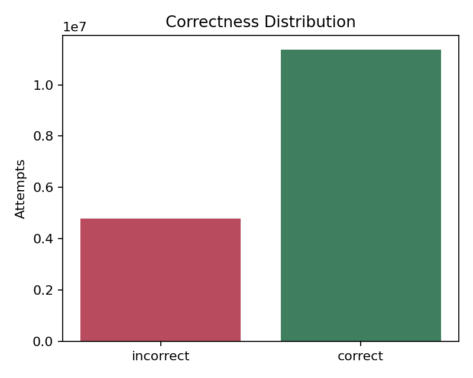
  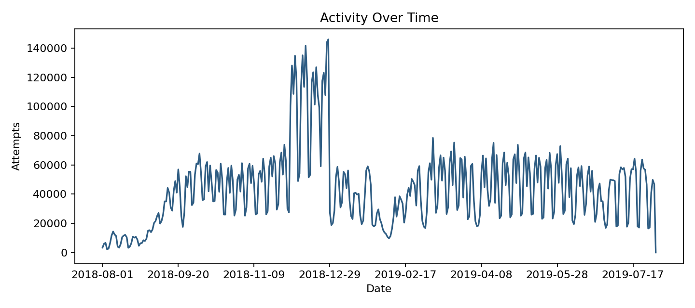
  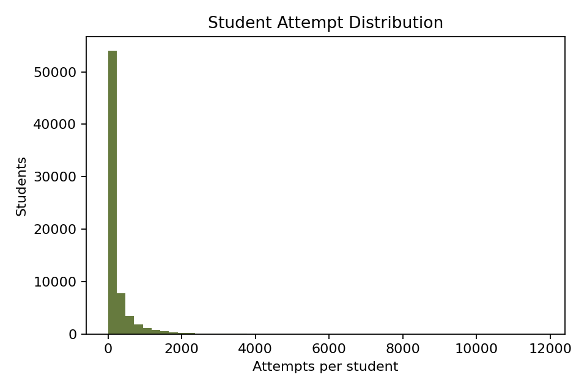
</p>

<p align="center">
  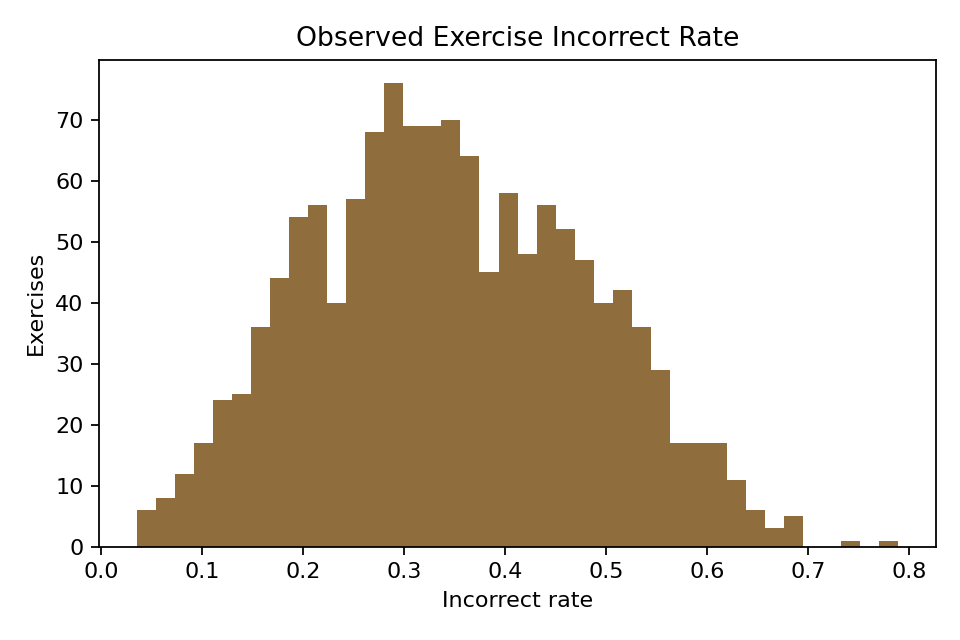
</p>

### Model Comparison

<p align="center">
  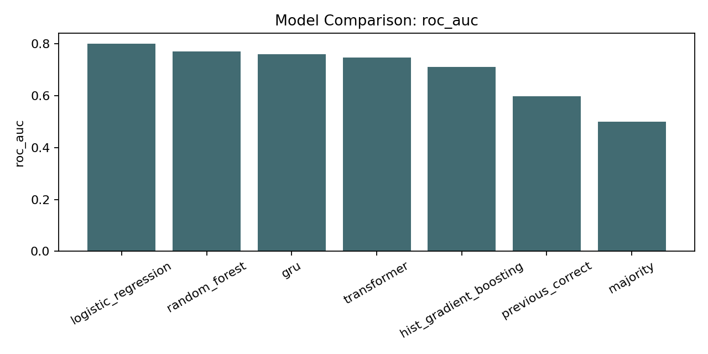
  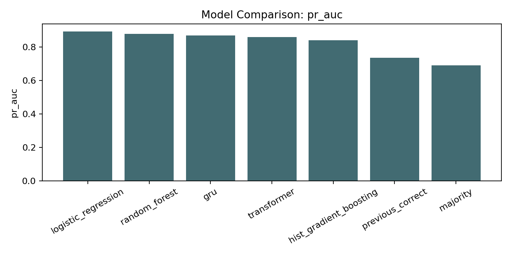
</p>

<p align="center">
  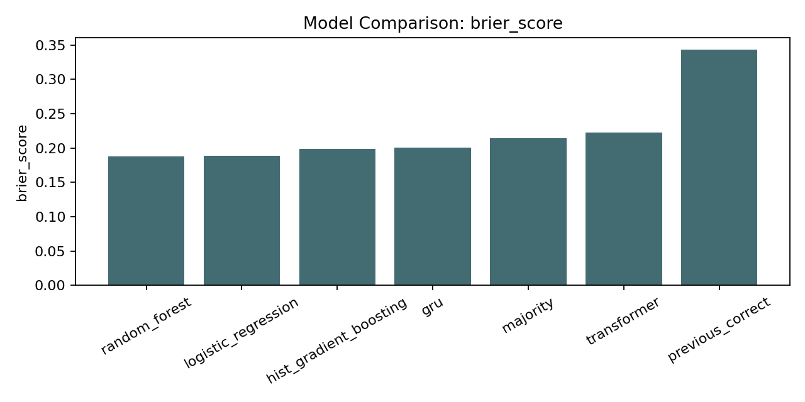
</p>

### Curves and Calibration

<p align="center">
  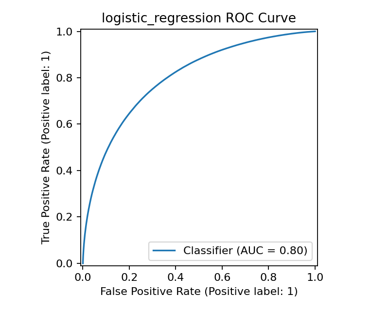
  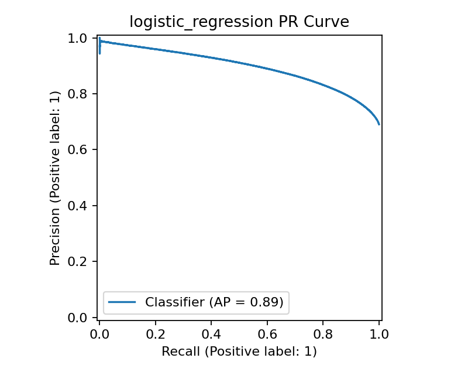
  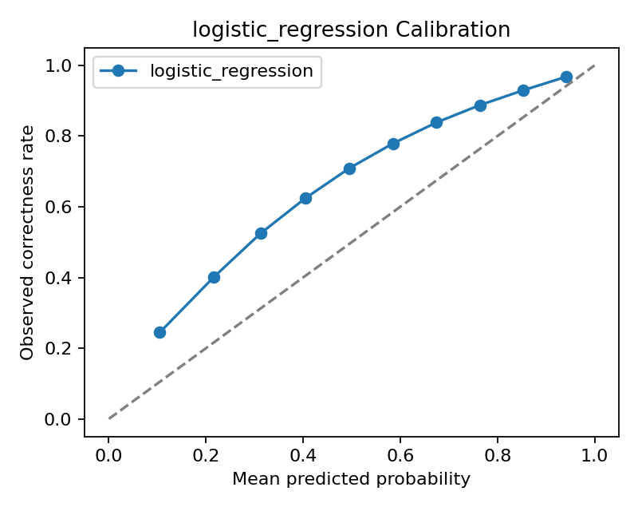
</p>

<p align="center">
  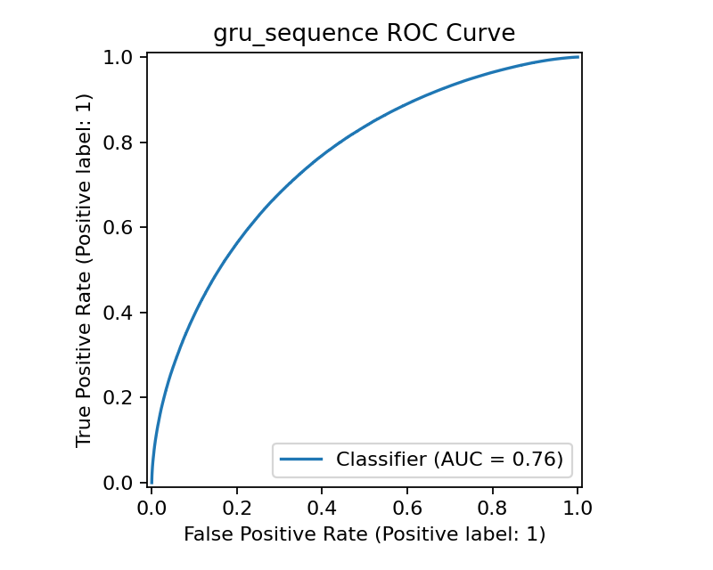
  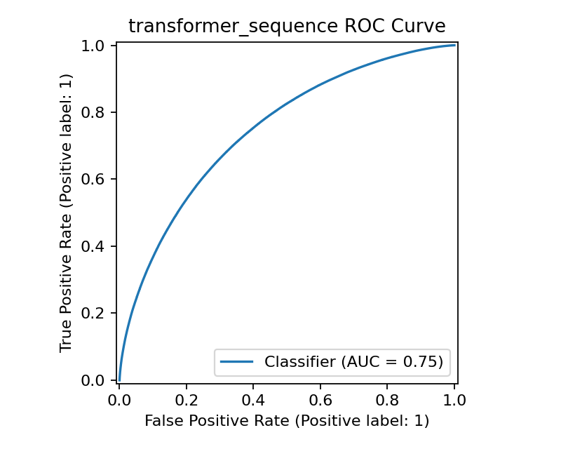
</p>

### Ablation and Uncertainty

<p align="center">
  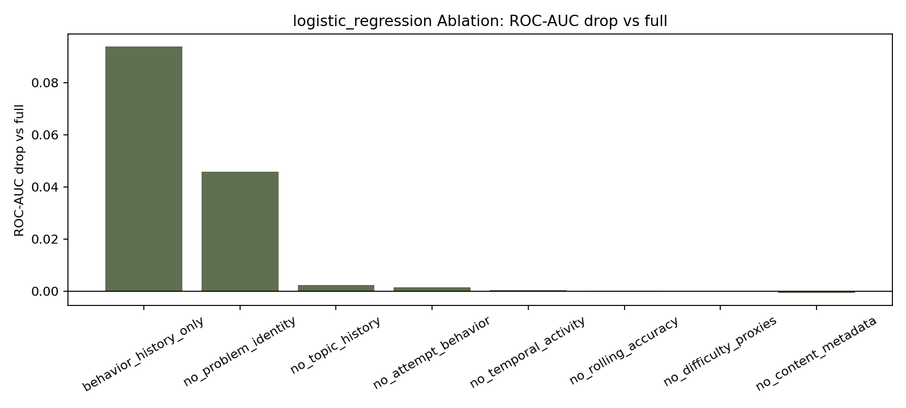
  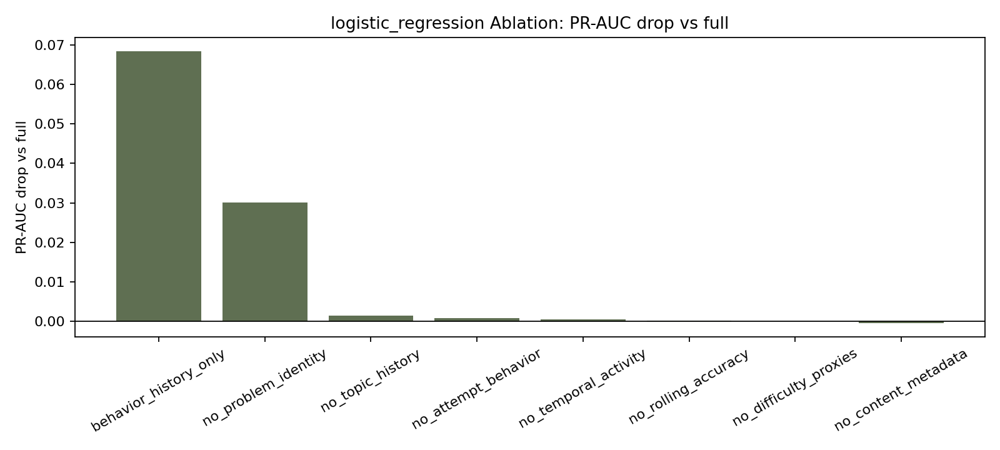
</p>

<p align="center">
  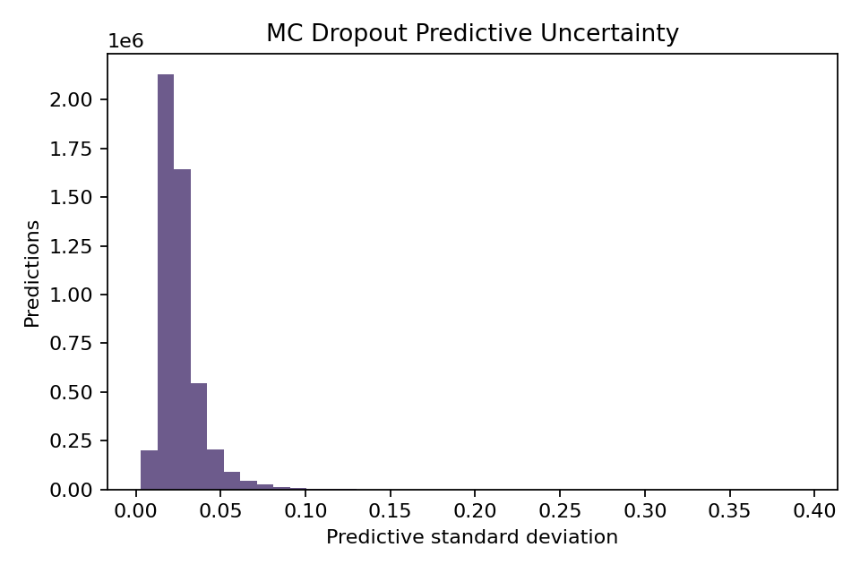
</p>

---

## Output Artifacts

Important output files include:

| Path | Description |
|---|---|
| `docs/tables/journal_model_ranking.csv` | Final model ranking table |
| `docs/tables/model_performance_comparison.csv` | Full model comparison metrics |
| `docs/tables/journal_metric_confidence_intervals.csv` | Confidence interval summary |
| `docs/tables/ablation_test_deltas.csv` | Ablation study results |
| `docs/tables/risk_group_analysis.csv` | Risk group table |
| `docs/reports/ablation_study_report.md` | Detailed ablation interpretation |
| `docs/reports/risk_group_analysis.md` | Detailed risk-group interpretation |
| `docs/figures/` | GitHub-safe figures for presentation and reporting |

---

## Reproducibility

### 1. Install Dependencies

```bash
python -m pip install -r requirements.txt
```

### 2. Place Dataset Files

Raw Junyi files are intentionally not tracked in Git because of size and dataset distribution constraints.

Place the files locally as:

```text
dataset/
  Log_Problem.csv
  Info_Content.csv
  Info_UserData.csv
```

### 3. Full Journal Run

```bash
python src/data/scan_dataset.py --config configs/gx10_journal.json --full
python src/features/build_features.py --config configs/gx10_journal.json
python src/models/train_baseline.py --config configs/gx10_journal.json
python src/models/train_transformer.py --config configs/gx10_journal.json --model-type transformer
python src/models/train_transformer.py --config configs/gx10_journal.json --model-type gru
python src/evaluation/evaluate_models.py --config configs/gx10_journal.json
python src/evaluation/ablation_study.py --config configs/gx10_ablation.json
python src/evaluation/journal_analysis.py --results-dir hasil_project_junyi_journal
```

### 4. Quick Smoke Test

```bash
python src/features/build_features.py --config configs/preflight.json
python src/models/train_baseline.py --config configs/preflight.json
python src/models/train_transformer.py --config configs/preflight.json --model-type transformer
python src/models/train_transformer.py --config configs/preflight.json --model-type gru
python src/evaluation/evaluate_models.py --config configs/preflight.json
python src/evaluation/ablation_study.py --config configs/preflight_ablation.json
```

---

## Repository Structure

```text
configs/
  Experiment configurations for preflight, full GX10, journal, and ablation runs.

data/
  raw/README.md
  Dataset placement note. Raw CSV files are not tracked.

docs/
  figures/
    Curated figures for README, presentation, and reports.
  reports/
    Journal-style summaries and interpretation files.
  tables/
    Curated CSV result tables.

src/
  common/
    Configuration loading, environment reporting, and logging helpers.
  data/
    Dataset scanning and schema validation.
  features/
    Cleaning, joining, temporal sorting, and leakage-aware feature engineering.
  models/
    Baseline models, GRU, Transformer, training loops, and MC Dropout inference.
  evaluation/
    Metrics, plots, ablation study, journal tables, and risk analysis.

requirements.txt
  Python dependencies.

README.md
  Main project documentation.
```

---

## Academic Interpretation

The main conclusion is:

> Junyi Academy online learning logs contain strong predictive signals for next-attempt correctness. A leakage-aware temporal feature engineering pipeline with content-context information achieved strong predictive performance. The best-performing model in this run was Logistic Regression, while GRU and Transformer sequence models provided temporal neural baselines. Monte Carlo Dropout enabled uncertainty-aware risk grouping, allowing predictions to be interpreted more cautiously for educational decision support.

This framing is intentionally conservative and academically defensible.

---

## Claims to Avoid

The following claims should not be made:

- The Transformer is the best-performing model.
- The system is ready for real-time deployment.
- The model proves causal effects of student behavior on achievement.
- The model can replace teachers or educational experts.
- The model performs student surveillance.
- The project uses visual tracking or camera data.
- The risk groups should automatically trigger interventions without human review.

---

## Limitations

- This is an offline historical analysis, not a deployed intervention system.
- The strongest predictive model is tabular, not Transformer-based.
- Problem/exercise identity is highly predictive and may reflect item-specific effects.
- Monte Carlo Dropout is an approximate Bayesian method, not a full Bayesian posterior.
- User metadata is intentionally not emphasized to avoid overreliance on profile-based prediction.
- Predictive performance does not imply causal explanation.
- The project evaluates correctness prediction, not long-term educational outcomes.

---

## Future Work

Potential extensions include:

- stronger knowledge tracing models,
- comparison with Deep Knowledge Tracing or SAINT-like architectures,
- calibration improvement using temperature scaling or isotonic regression,
- student-level generalization experiments,
- cold-start student analysis,
- content-level diagnostic analysis,
- teacher-facing explanation dashboard,
- intervention simulation under human-in-the-loop constraints.

---

## Project Status

The project is complete as a reproducible educational data mining pipeline.

Completed components:

- full dataset scan,
- schema validation,
- content metadata join,
- leakage-aware feature engineering,
- temporal split,
- baseline model training,
- GRU and Transformer sequence modeling,
- MC Dropout uncertainty estimation,
- ablation study,
- risk-group analysis,
- curated tables and figures,
- academic-style documentation.

Remaining optional work:

- manuscript writing,
- slide preparation,
- additional robustness checks,
- external benchmark comparison.
