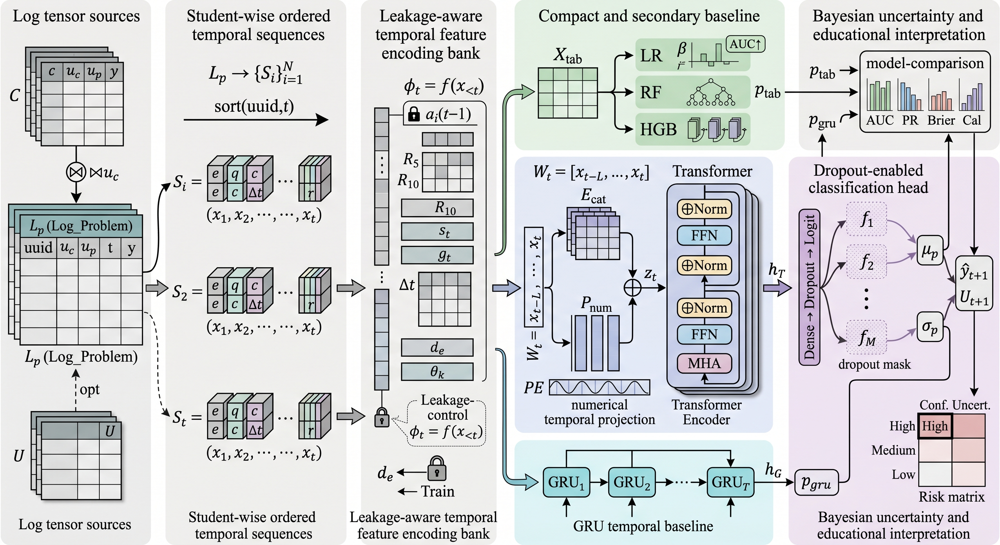
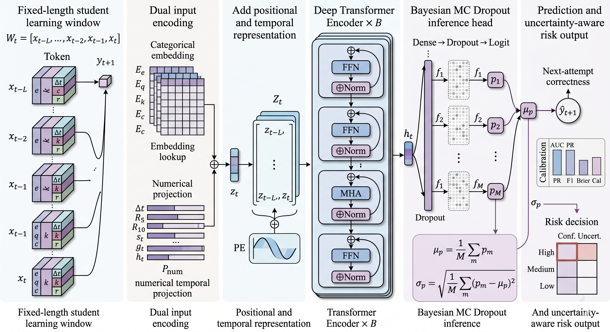

# Bayesian Transformer-Based Temporal Learning Behavior Modeling for Student Performance Prediction

<p align="center">
  <b>A leakage-aware educational data mining project using Junyi Academy online learning activity logs.</b>
</p>

<p align="center">
  <i>Temporal learning behavior modeling · Next-attempt correctness prediction · Comparative machine learning · Bayesian uncertainty-aware risk analysis</i>
</p>

<p align="center">
  
  
  
  
  
  
  
</p>

---

## 1. Executive Summary

This repository presents a complete, reproducible **educational data mining** project for predicting student learning performance from large-scale online learning logs. The project uses the **Junyi Academy Online Learning Activity Dataset**, a public dataset released through Kaggle that contains more than **16 million** exercise attempt logs from more than **72,000** students over approximately one academic year.

The task is formulated as **temporal next-attempt correctness prediction**. Given a student's prior online learning history, the system predicts whether the next problem attempt will be correct. This framing is directly aligned with **learning analytics**, **educational data mining**, **student performance prediction**, and **knowledge tracing-adjacent research**.

The project title is:

> **Bayesian Transformer-Based Temporal Learning Behavior Modeling for Student Performance Prediction**

The completed experiment should be interpreted carefully. Although the project includes GRU and Transformer sequence models, the strongest test performance was achieved by a leakage-aware **Logistic Regression** model using engineered temporal behavior and exercise/content context features. The sequence models remain important because they provide neural temporal baselines and enable **Bayesian uncertainty-aware risk grouping** through Monte Carlo Dropout.

The strongest academic interpretation is:

> Junyi Academy online learning logs contain strong predictive signals for next-attempt correctness. Leakage-aware temporal feature engineering and content-context information provide strong predictive performance, while sequence models and Bayesian uncertainty estimation support risk-aware educational interpretation.

---

## 2. Table of Contents

- [1. Executive Summary](#1-executive-summary)
- [2. Table of Contents](#2-table-of-contents)
- [3. Project Scope and Research Positioning](#3-project-scope-and-research-positioning)
  - [3.1 Educational Data Scope](#31-educational-data-scope)
  - [3.2 What This Project Does Not Do](#32-what-this-project-does-not-do)
  - [3.3 Why the Project Matters](#33-why-the-project-matters)
- [4. Dataset Source and Citation](#4-dataset-source-and-citation)
  - [4.1 Official Dataset Source](#41-official-dataset-source)
  - [4.2 Original Dataset Citation](#42-original-dataset-citation)
- [5. Research Questions](#5-research-questions)
- [6. Dataset Inventory and Schema](#6-dataset-inventory-and-schema)
  - [6.1 Full Dataset Inventory](#61-full-dataset-inventory)
  - [6.2 Schema Alignment](#62-schema-alignment)
  - [6.3 Verified Table Relationship](#63-verified-table-relationship)
- [7. Problem Formulation](#7-problem-formulation)
  - [7.1 Temporal Next-Attempt Prediction](#71-temporal-next-attempt-prediction)
  - [7.2 Binary Classification Objective](#72-binary-classification-objective)
- [8. Methodology](#8-methodology)
  - [8.1 Proposed System and Model Architecture](#81-proposed-system-and-model-architecture)
  - [8.2 Methodological Pipeline](#82-methodological-pipeline)
  - [8.3 Student-Wise Temporal Ordering](#83-student-wise-temporal-ordering)
  - [8.4 Leakage-Aware Feature Construction](#84-leakage-aware-feature-construction)
  - [8.5 Temporal Train/Validation/Test Split](#85-temporal-trainvalidationtest-split)
  - [8.6 Logistic Regression Baseline](#86-logistic-regression-baseline)
  - [8.7 GRU Sequence Model](#87-gru-sequence-model)
  - [8.8 Transformer Encoder Sequence Model](#88-transformer-encoder-sequence-model)
  - [8.9 Monte Carlo Dropout Bayesian Approximation](#89-monte-carlo-dropout-bayesian-approximation)
  - [8.10 Risk Group Formulation](#810-risk-group-formulation)
- [9. Feature Engineering](#9-feature-engineering)
- [10. Training Environment](#10-training-environment)
- [11. Model Evaluation Metrics](#11-model-evaluation-metrics)
- [12. Main Experimental Results](#12-main-experimental-results)
- [13. Ablation Study](#13-ablation-study)
- [14. Bayesian Uncertainty and Risk Group Analysis](#14-bayesian-uncertainty-and-risk-group-analysis)
- [15. Reproducibility](#15-reproducibility)
- [16. Repository Structure](#16-repository-structure)
- [17. Academic Interpretation](#17-academic-interpretation)
- [18. Limitations](#18-limitations)
- [19. Future Work](#19-future-work)
- [20. Project Status](#20-project-status)

---

## 3. Project Scope and Research Positioning

### 3.1 Educational Data Scope

This project is strictly based on **educational learning logs**. The unit of analysis is:

> **A student's chronological sequence of online problem attempts.**

The term **temporal** refers to the ordering of learning events over time. Each event corresponds to a student attempting a problem on the Junyi Academy platform.

### 3.2 What This Project Does Not Do

This project does **not** use:

- computer vision,
- camera monitoring,
- face recognition,
- object detection,
- bounding boxes,
- physical trajectories,
- person re-identification,
- classroom surveillance.

This clarification is important because the project is designed for **Data Science** and **Educational Data**, not image-based tracking or physical spatiotemporal analysis.

### 3.3 Why the Project Matters

Online learning platforms capture detailed traces of how students interact with learning materials: what exercises they attempt, when they attempt them, whether they answer correctly, how long they spend, whether they use hints, and how their learning behavior evolves over time.

These records can support:

- learning analytics,
- early warning analysis,
- adaptive practice,
- personalized learning pathways,
- teacher-facing decision support,
- educational data mining research.

However, educational log modeling is methodologically sensitive. A model can appear strong if future information leaks into training features. For example, random row-level splitting may allow a student's future behavior to influence training, and aggregate difficulty features can accidentally include the label of the same row being predicted. This repository explicitly addresses these concerns through temporal within-student splitting, shifted historical features, train-only difficulty estimates, and leave-one-out encodings for training aggregates.

---

## 4. Dataset Source and Citation

### 4.1 Official Dataset Source

Dataset used in this project:

**Junyi Academy Online Learning Activity Dataset**  
Kaggle source:  
https://www.kaggle.com/datasets/junyiacademy/learning-activity-public-dataset-by-junyi-academy

The dataset is released by **Junyi Academy Foundation**, a Taiwan-based nonprofit educational organization. The dataset description states that it contains over 16 million exercise attempt logs from more than 72,000 students across the period from 2018/08 to 2019/07.

### 4.2 Original Dataset Citation

```bibtex
@article{JunyiOnlineLearningDataset,
  title={Junyi Academy Online Learning Activity Dataset: A large-scale public online learning activity dataset from elementary to senior high school students.},
  author={Pojen, Chen and Mingen, Hsieh and Tzuyang, Tsai},
  journal={Dataset available from https://www.kaggle.com/junyiacademy/learning-activity-public-dataset-by-junyi-academy},
  year={2020}
}
```

---

## 5. Research Questions

| ID | Research Question | Why It Matters |
|---|---|---|
| RQ1 | Can prior online learning behavior predict next-attempt correctness? | Tests whether student learning logs contain useful temporal predictive signals. |
| RQ2 | Which feature families contribute most to prediction? | Identifies whether behavior history, problem identity, topic history, or content metadata carries the strongest signal. |
| RQ3 | How do sequence models compare with tabular baselines? | Evaluates whether GRU/Transformer architectures improve temporal representation learning over engineered features. |
| RQ4 | Can Bayesian uncertainty estimation improve educational interpretation? | Distinguishes confident risk predictions from uncertain predictions. |
| RQ5 | What type of risk grouping is suitable for cautious learning analytics? | Supports human-in-the-loop educational decision support rather than automated intervention. |

---

## 6. Dataset Inventory and Schema

### 6.1 Full Dataset Inventory

A full streaming scan was performed before modeling. This was done to avoid assuming the structure of the dataset before inspecting the actual CSV files.

| File | Rows | Role |
|---|---:|---|
| `Log_Problem.csv` | 16,217,311 | Main online exercise attempt log |
| `Info_Content.csv` | 1,330 | Exercise/content metadata |
| `Info_UserData.csv` | 72,758 | Optional user metadata |

Additional verified dataset statistics:

| Quantity | Value |
|---|---:|
| Raw attempt records | 16,217,311 |
| Processed temporal rows | 16,144,553 |
| Unique students | 72,758 |
| Unique exercises | 1,326 |
| Unique problems | 25,785 |
| Correct attempts | 11,412,558 |
| Incorrect attempts | 4,804,753 |
| Date range | 2018-08-01 to 2019-08-01 |

### 6.2 Schema Alignment

The project uses the actual Junyi schema after scanning the CSV files.

#### 6.2.1 Main Log Table: `Log_Problem.csv`

| Column | Meaning in This Project |
|---|---|
| `timestamp_TW` | Timestamp used for chronological ordering |
| `uuid` | Student identifier |
| `ucid` | Exercise/content identifier |
| `upid` | Problem identifier |
| `problem_number` | Problem order or index within content |
| `exercise_problem_repeat_session` | Repeat/session information |
| `is_correct` | Correctness label |
| `total_sec_taken` | Time spent on the attempt |
| `total_attempt_cnt` | Attempt count |
| `used_hint_cnt` | Number of hints used |
| `is_hint_used` | Whether hint was used |
| `is_downgrade` | Whether student downgraded |
| `is_upgrade` | Whether student upgraded |
| `level` | Exercise or mastery-related level field |

#### 6.2.2 Content Metadata: `Info_Content.csv`

| Column | Meaning in This Project |
|---|---|
| `ucid` | Join key with `Log_Problem.csv` |
| `content_pretty_name` | Human-readable content name |
| `content_kind` | Type of content |
| `difficulty` | Provided content difficulty |
| `subject` | Subject area |
| `learning_stage` | Learning stage |
| `level1_id` | Curriculum hierarchy level 1 |
| `level2_id` | Curriculum hierarchy level 2 |
| `level3_id` | Curriculum hierarchy level 3 |
| `level4_id` | Curriculum hierarchy level 4 |

#### 6.2.3 User Metadata: `Info_UserData.csv`

User metadata is available, but it is intentionally not the central predictive focus. The study emphasizes **learning behavior** and **content interaction patterns**, not demographic profiling.

### 6.3 Verified Table Relationship

The main verified join is:

```text
Log_Problem.ucid = Info_Content.ucid
```

The dataset scan confirmed that logged content identifiers have matching content metadata. This allows the project to enrich attempt logs with curriculum/content information while maintaining schema validity.

---

## 7. Problem Formulation

### 7.1 Temporal Next-Attempt Prediction

For each student $`u`$, the raw attempts are sorted chronologically:

$$
\mathcal{S}_u = \{a_{u,1}, a_{u,2}, \ldots, a_{u,t}, \ldots, a_{u,T_u}\}
$$

where $`a_{u,t}`$ denotes the $`t`$-th problem attempt made by student $`u`$, and $`T_u`$ is the total number of attempts for that student.

Each attempt contains behavioral and content information:

$$
a_{u,t} = (x_{u,t}, y_{u,t})
$$

where $`x_{u,t}`$ represents observed features and $`y_{u,t} \in \{0,1\}`$ represents correctness.

The prediction problem is:

$$
\hat{p}_{u,t} = P(y_{u,t}=1 \mid a_{u,1}, a_{u,2}, \ldots, a_{u,t-1})
$$

In words, the model predicts whether the target attempt will be correct using only the student's prior learning history.

### 7.2 Binary Classification Objective

For tabular models, the prediction is based on a leakage-aware feature vector \(\phi_{u,t}\):

$$
\hat{p}_{u,t} = f_\theta\left(\phi_{u,t}\right)
$$

where \(\phi_{u,t}\) includes only information available before attempt \(t\).

The binary cross-entropy loss is:

$$
\mathcal{L}_{BCE}
= -\frac{1}{N}\sum_{i=1}^{N}\left[y_i \log\left(\hat{p}_i\right) + \left(1-y_i\right)\log\left(1-\hat{p}_i\right)\right]
$$

This objective is used for neural sequence models and conceptually aligns with probabilistic binary classification.

---

## 8. Methodology

### 8.1 Proposed System and Model Architecture

The proposed research framework is organized around two complementary views: the full end-to-end educational data mining system and the Bayesian Transformer model used for uncertainty-aware temporal prediction.

#### 8.1.1 Overall System Architecture

<p align="center">
  
</p>

**Figure 1. Overall system architecture.**  
The framework begins with Junyi Academy log tensor sources, transforms raw exercise attempts into student-wise ordered temporal sequences, constructs leakage-aware temporal features, compares tabular and sequence models, and produces uncertainty-aware educational risk interpretation. Tabular baselines, GRU, and Transformer models are compared rather than fused into a single ensemble. The risk matrix is connected to Bayesian uncertainty outputs from MC Dropout inference.

#### 8.1.2 Proposed Bayesian Transformer Architecture

<p align="center">
  
</p>

**Figure 2. Proposed Bayesian Transformer architecture.**  
A fixed-length student learning window is encoded through categorical embeddings and numerical temporal projections, enriched with positional encoding, processed by Transformer Encoder blocks, and passed through an MC Dropout inference head to estimate both mean predicted correctness and predictive uncertainty. This figure represents the proposed uncertainty-aware sequence model, while the empirical study still compares it against tabular and GRU baselines.

### 8.2 Methodological Pipeline

The full experimental pipeline is:

```text
Raw Junyi CSV files
    -> dataset scan and schema validation
    -> data cleaning and type standardization
    -> content metadata joining
    -> student-wise chronological sorting
    -> leakage-aware temporal feature engineering
    -> temporal train/validation/test split
    -> baseline model training
    -> sliding-window sequence construction
    -> GRU and Transformer sequence modeling
    -> Monte Carlo Dropout uncertainty estimation
    -> model evaluation and comparison
    -> ablation study
    -> risk group analysis
    -> journal-style tables, figures, and reports
```

The central methodological principle is:

> Each prediction must use only information that would have been available before the target attempt.

### 8.3 Student-Wise Temporal Ordering

For each student, all problem attempts are sorted in chronological order before feature engineering and sequence construction.

The implementation sorts records using three keys in this order:

| Order | Key | Purpose |
|---:|---|---|
| 1 | `uuid` | Groups records by student |
| 2 | `timestamp_TW` | Orders attempts by time |
| 3 | `raw_row_id` | Resolves ties when multiple attempts have the same timestamp |

The stable `raw_row_id` ensures deterministic ordering when two or more records share the same timestamp.

This ordering step is important because all historical features must be computed from past attempts only. Without stable chronological ordering, rolling accuracy, previous correctness, streak features, and sequence windows could become inconsistent.

### 8.4 Leakage-Aware Feature Construction

#### 8.4.1 Previous Accuracy

The previous accuracy of a student before attempt \(t\) is computed as:

$$
\text{PrevAcc}_{u,t}
= \frac{\sum_{j=1}^{t-1} y_{u,j}}{t-1}
$$

This excludes the current target label \(y_{u,t}\).

#### 8.4.2 Rolling Accuracy

The rolling accuracy over the previous \(k\) attempts is:

$$
\text{RollAcc}_{u,t}^{(k)}
= \frac{1}{k}\sum_{j=t-k}^{t-1} y_{u,j}
$$

where only attempts before \(t\) are included. In this project, rolling windows such as \(k=5\) and \(k=10\) are used.

#### 8.4.3 Time Gap

The time gap between two consecutive attempts is:

$$
\Delta t_{u,t} = \text{timestamp}_{u,t} - \text{timestamp}_{u,t-1}
$$

This feature captures learning rhythm, spacing, and inactivity periods.

#### 8.4.4 Exercise Difficulty Proxy

For validation and test rows, empirical exercise difficulty is estimated only from the training split:

$$
\text{Diff}_{e}
= 1 - \frac{\sum_{i \in \mathcal{D}_{train}(e)} y_i}{\left|\mathcal{D}_{train}(e)\right|}
$$

where \(e\) is an exercise or content identifier.

For training rows, leave-one-out encoding is used to avoid including the row's own label:

$$
\text{Diff}_{e,i}^{LOO}
= 1 - \frac{\sum_{j \in \mathcal{D}_{train}(e), j \neq i} y_j}{\left|\mathcal{D}_{train}(e)\right|-1}
$$

This prevents target leakage in aggregate encodings.

### 8.5 Temporal Train/Validation/Test Split

The final processed data is split temporally within each student.

| Split | Rows |
|---|---:|
| Train | 11,247,540 |
| Validation | 2,431,344 |
| Test | 2,465,669 |

This strategy is more realistic than random row splitting because it evaluates whether earlier behavior can predict later behavior for the same student.

### 8.6 Logistic Regression Baseline

The Logistic Regression model estimates correctness probability as:

$$
\hat{p}_i = \sigma\left(\mathbf{w}^{\top}\mathbf{x}_i + b\right)
$$

where:

$$
\sigma(z)=\frac{1}{1+e^{-z}}
$$

The model is simple but highly interpretable. In the completed experiment, it achieved the best ROC-AUC and PR-AUC because the engineered temporal and content-context features are highly informative.

### 8.7 GRU Sequence Model

For the GRU model, each input sequence is:

$$
\mathbf{X}_{u,t}^{(k)} = \left[\mathbf{x}_{u,t-k}, \ldots, \mathbf{x}_{u,t-2}, \mathbf{x}_{u,t-1}\right]
$$

The GRU updates its hidden state using reset and update gates:

$$
\mathbf{z}_t = \sigma\left(\mathbf{W}_z \mathbf{x}_t + \mathbf{U}_z \mathbf{h}_{t-1} + \mathbf{b}_z\right)
$$

$$
\mathbf{r}_t = \sigma\left(\mathbf{W}_r \mathbf{x}_t + \mathbf{U}_r \mathbf{h}_{t-1} + \mathbf{b}_r\right)
$$

$$
\tilde{\mathbf{h}}_t = \tanh\left(\mathbf{W}_h \mathbf{x}_t + \mathbf{U}_h\left(\mathbf{r}_t \odot \mathbf{h}_{t-1}\right) + \mathbf{b}_h\right)
$$

$$
\mathbf{h}_t = \left(1-\mathbf{z}_t\right)\odot \mathbf{h}_{t-1} + \mathbf{z}_t \odot \tilde{\mathbf{h}}_t
$$

The final hidden state is passed to a binary classification head.

### 8.8 Transformer Encoder Sequence Model

The Transformer model treats prior student attempts as an ordered sequence:

$$
\mathbf{X}_{u,t}^{(k)} = \left[\mathbf{x}_{u,t-k}, \ldots, \mathbf{x}_{u,t-1}\right]
$$

Categorical variables are mapped into embeddings, numerical features are projected into the same representation space, and positional information is added:

$$
\mathbf{H}^{(0)} = \text{Embed}\left(\mathbf{X}\right) + \text{PosEnc}\left(\mathbf{X}\right)
$$

Self-attention is computed as:

$$
\text{Attention}\left(\mathbf{Q},\mathbf{K},\mathbf{V}\right)
= \text{softmax}\left(\frac{\mathbf{Q}\mathbf{K}^{\top}}{\sqrt{d_k}}\right)\mathbf{V}
$$

Multi-head attention is:

$$
\text{MultiHead}\left(\mathbf{H}\right)
= \text{Concat}\left(\text{head}_1, \ldots, \text{head}_m\right)\mathbf{W}^{O}
$$

where:

$$
\text{head}_i = \text{Attention}\left(\mathbf{H}\mathbf{W}_i^Q, \mathbf{H}\mathbf{W}_i^K, \mathbf{H}\mathbf{W}_i^V\right)
$$

The final representation is passed to a classifier:

$$
\hat{p}_{u,t}=\sigma\left(\mathbf{w}^{\top}\mathbf{h}_{u,t}^{final}+b\right)
$$

The Transformer is aligned with the project title because it models temporal learning histories using attention over prior attempts. However, in the completed experiment, it is not overclaimed as the best-performing model.

### 8.9 Monte Carlo Dropout Bayesian Approximation

Monte Carlo Dropout approximates Bayesian predictive uncertainty by keeping dropout active during inference.

For \(M\) stochastic forward passes:

$$
\hat{p}_{i}^{(m)} = f_{\theta}^{(m)}\left(\mathbf{x}_i\right), \quad m=1,2,\ldots,M
$$

The final predictive mean is:

$$
\mu_i = \frac{1}{M}\sum_{m=1}^{M}\hat{p}_{i}^{(m)}
$$

The predictive uncertainty is estimated using predictive standard deviation:

$$
\sigma_i = \sqrt{\frac{1}{M}\sum_{m=1}^{M}\left(\hat{p}_{i}^{(m)}-\mu_i\right)^2}
$$

This allows the project to separate correctness probability from uncertainty.

### 8.10 Risk Group Formulation

Risk groups are defined from predicted correctness probability \(\mu_i\) and uncertainty \(\sigma_i\).

A simple probability-based grouping is:

$$
\text{Risk}(i)=
\begin{cases}
\text{High-risk}, & \mu_i < \tau_{low} \\
\text{Medium-risk}, & \tau_{low} \leq \mu_i < \tau_{high} \\
\text{Low-risk}, & \mu_i \geq \tau_{high}
\end{cases}
$$

Uncertainty grouping is defined by a quantile threshold \(q\):

$$
\text{Uncertain}(i)=\mathbb{1}\left[\sigma_i \geq Q_q\left(\sigma\right)\right]
$$

The combination of risk and uncertainty creates groups such as **high-risk confident**, **high-risk uncertain**, and **low-risk confident**.

---

## 9. Feature Engineering

The engineered features are designed to represent educationally meaningful learning behavior.

| Feature Family | Example Features | Educational Meaning |
|---|---|---|
| Prior correctness history | `student_prev_accuracy`, `prev_is_correct`, `hist_correct_count` | Student mastery signal before the target attempt |
| Rolling performance | `rolling_accuracy_5`, `rolling_accuracy_10` | Short-term learning momentum |
| Streak features | `consecutive_correct_count`, `consecutive_wrong_count` | Local persistence, struggle, or confidence |
| Temporal rhythm | `time_gap_sec`, `daily_activity_count_prior`, `session_attempt_index` | Learning spacing and study rhythm |
| Previous attempt behavior | `prev_total_sec_taken`, `prev_used_hint_cnt`, `student_exercise_attempt_count_prior` | Prior effort, hint use, and repeated practice |
| Topic history | `topic_attempt_count_prior`, `topic_prev_accuracy` | Prior topic-level experience |
| Content context | `difficulty`, `learning_stage`, `level2_id`, `level3_id`, `level4_id` | Curriculum/content structure |
| Problem identity | `ucid`, `upid` | Exercise/problem-specific context |
| Difficulty proxies | `exercise_incorrect_rate_train`, `topic_incorrect_rate_train` | Empirical item/topic difficulty estimated safely |

The feature design combines two types of signals:

1. **Learning behavior signals**, such as previous accuracy, time gaps, streaks, and hint-related history.
2. **Learning content signals**, such as exercise ID, problem ID, curriculum level, and difficulty.

The ablation study shows that content/problem identity contributes strongly to predictive performance, while behavioral features remain important for educational interpretation and sequence modeling.

---

## 10. Training Environment

The full training run was executed on a local GX10 machine. The environment was recorded during training to improve reproducibility and to make the computational context clear.

| Component | Value |
|---|---|
| Python | 3.10.20 |
| Operating system | Linux 6.17.0-1014-nvidia-aarch64 with glibc 2.39 |
| CPU count | 20 |
| System memory | 121.63 GB |
| PyTorch | 2.11.0+cu130 |
| CUDA available | Yes |
| CUDA device count | 1 |
| GPU | NVIDIA GB10 |
| Main sequence batch size | 512 |
| Transformer epochs | 8 |
| MC Dropout passes | 50 |

### 10.1 Why Environment Reporting Matters

The dataset contains more than 16 million raw attempts and more than 16 million processed temporal rows. Reporting the training environment helps readers understand the computational scale of the experiment and makes it easier to reproduce or adapt the pipeline on another machine.

### 10.2 Recommended Configuration for Full Run

```json
{
  "preprocessing": {
    "mode": "full",
    "output_file": "attempt_features_full.csv"
  },
  "baseline": {
    "max_train_rows": null,
    "max_eval_rows": null
  },
  "sequence": {
    "batch_size": 512,
    "epochs": 8,
    "max_train_sequences": null,
    "max_val_sequences": null,
    "max_test_sequences": null,
    "checkpoint_name": "temporal_transformer_gx10_full.pt"
  },
  "uncertainty": {
    "mc_dropout_passes": 50
  }
}
```

---

## 11. Model Evaluation Metrics

The project uses several metrics because no single metric fully describes model quality.

### 11.1 ROC-AUC

ROC-AUC measures whether the model ranks positive examples higher than negative examples:

$$
\text{ROC-AUC} = P\left(s^+ > s^-\right)
$$

where \(s^+\) is the score assigned to a positive example and \(s^-\) is the score assigned to a negative example.

### 11.2 Precision, Recall, and F1-Score

Precision and recall are:

$$
\text{Precision}=\frac{TP}{TP+FP}
$$

$$
\text{Recall}=\frac{TP}{TP+FN}
$$

The F1-score is:

$$
F_1 = 2\cdot\frac{\text{Precision}\cdot\text{Recall}}{\text{Precision}+\text{Recall}}
$$

### 11.3 Brier Score

The Brier Score measures probability calibration error:

$$
\text{Brier}=\frac{1}{N}\sum_{i=1}^{N}\left(\hat{p}_i-y_i\right)^2
$$

Lower Brier Score indicates better calibrated probability estimates.

### 11.4 Metric Summary

| Metric | Purpose |
|---|---|
| ROC-AUC | Measures ranking ability across classification thresholds |
| PR-AUC | Evaluates precision-recall tradeoff under class imbalance |
| F1-score | Balances precision and recall at a selected threshold |
| Brier Score | Measures probability calibration error |
| Calibration Curve | Visualizes reliability of predicted probabilities |
| Confusion Matrix | Shows classification error patterns |
| Risk Group Observed Correctness | Tests whether predicted risk groups align with actual outcomes |

---

## 12. Main Experimental Results

Final test performance:

| Rank | Model | ROC-AUC | PR-AUC | F1 | Brier |
|---:|---|---:|---:|---:|---:|
| 1 | Logistic Regression | 0.801 | 0.894 | 0.766 | 0.189 |
| 2 | Random Forest | 0.771 | 0.879 | 0.772 | 0.188 |
| 3 | GRU | 0.759 | 0.869 | 0.752 | 0.201 |
| 4 | Transformer | 0.747 | 0.859 | 0.698 | 0.223 |
| 5 | HistGradientBoosting | 0.711 | 0.840 | 0.824 | 0.199 |
| 6 | Previous Correct | 0.598 | 0.736 | 0.751 | 0.344 |
| 7 | Majority | 0.500 | 0.691 | 0.817 | 0.214 |

### 12.1 Result Interpretation

The best-performing model by ROC-AUC and PR-AUC is **Logistic Regression**. This is an important and defensible result. It shows that carefully engineered temporal and content-context features can be highly predictive even with a simple linear model.

The sequence models remain valuable:

- **GRU** is the strongest neural sequence model in this experiment.
- **Transformer** provides an attention-based sequence modeling baseline.
- **MC Dropout** enables uncertainty-aware analysis beyond standard classification metrics.

The correct conclusion is not that the Transformer dominates all models. The correct conclusion is that **leakage-aware temporal feature engineering is highly effective**, and sequence models provide additional temporal and uncertainty-aware perspectives.

---

## 13. Ablation Study

A feature-family ablation study was conducted using Logistic Regression.

| Ablation | ROC-AUC | ROC-AUC Drop | PR-AUC Drop | Brier Increase |
|---|---:|---:|---:|---:|
| Full feature set | 0.801 | 0.000 | 0.000 | 0.000 |
| Behavior-history-only | 0.707 | 0.094 | 0.068 | 0.031 |
| No problem/exercise identity | 0.756 | 0.046 | 0.030 | 0.019 |
| No topic history | 0.799 | 0.002 | 0.001 | 0.002 |
| No previous attempt behavior | 0.800 | 0.002 | 0.001 | 0.000 |
| No temporal activity | 0.801 | 0.001 | 0.001 | -0.001 |
| No rolling accuracy | 0.801 | 0.000 | 0.000 | -0.000 |
| No difficulty proxies | 0.801 | 0.000 | 0.000 | 0.000 |
| No content metadata | 0.802 | -0.001 | -0.000 | -0.000 |

### 13.1 Ablation Interpretation

The ablation study shows that the model benefits strongly from problem/exercise identity and broader content context. When only behavior-history features are used, ROC-AUC drops from 0.801 to 0.707. Removing problem/exercise identity also causes a substantial ROC-AUC drop to 0.756.

This suggests that student performance prediction in this dataset is driven by both:

1. **What the student is attempting**, represented by problem, exercise, and content context.
2. **How the student has been learning**, represented by temporal behavior history.

The result is educationally meaningful because student success depends not only on the learner's prior behavior, but also on the difficulty and identity of the content being attempted.

---

## 14. Bayesian Uncertainty and Risk Group Analysis

Monte Carlo Dropout uncertainty was used to build risk-aware prediction groups.

| Risk Group | Count | Observed Correctness | Mean Predicted Correctness | Mean Predictive Std |
|---|---:|---:|---:|---:|
| High-risk confident | 1,549,224 | 0.462 | 0.245 | 0.019 |
| High-risk uncertain | 130,360 | 0.553 | 0.328 | 0.042 |
| Medium-risk confident | 1,430,155 | 0.741 | 0.546 | 0.023 |
| Medium-risk uncertain | 571,568 | 0.754 | 0.562 | 0.045 |
| Low-risk confident | 953,093 | 0.909 | 0.825 | 0.022 |
| Low-risk uncertain | 281,190 | 0.892 | 0.785 | 0.045 |

### 14.1 Educational Interpretation

The risk grouping is one of the most important educational outputs of the project.

- **High-risk confident** attempts are the clearest candidates for prioritized educational review.
- **High-risk uncertain** attempts should be interpreted cautiously because the model predicts difficulty but has higher uncertainty.
- **Low-risk confident** attempts correspond to strong expected performance.
- **Medium-risk groups** represent cases where support may depend on additional instructional context.

This analysis supports a human-in-the-loop perspective. The model should not automatically decide interventions. Instead, it can help identify where a teacher, tutor, or learning platform may want to pay closer attention.

---

## 15. Reproducibility

### 15.1 Install Dependencies

```bash
python -m pip install -r requirements.txt
```

### 15.2 Place Dataset Files

Raw Junyi files are intentionally not tracked in Git because of size and dataset distribution constraints.

Place the files locally as:

```text
dataset/
  Log_Problem.csv
  Info_Content.csv
  Info_UserData.csv
```

### 15.3 Full Journal Run

```bash
python src/data/scan_dataset.py --config configs/gx10_journal.json --full
python src/features/build_features.py --config configs/gx10_journal.json
python src/models/train_baseline.py --config configs/gx10_journal.json
python src/models/train_transformer.py --config configs/gx10_journal.json --model-type transformer
python src/models/train_transformer.py --config configs/gx10_journal.json --model-type gru
python src/evaluation/evaluate_models.py --config configs/gx10_journal.json
python src/evaluation/ablation_study.py --config configs/gx10_ablation.json
python src/evaluation/journal_analysis.py --results-dir hasil_project_junyi_journal
```

### 15.4 Quick Smoke Test

```bash
python src/features/build_features.py --config configs/preflight.json
python src/models/train_baseline.py --config configs/preflight.json
python src/models/train_transformer.py --config configs/preflight.json --model-type transformer
python src/models/train_transformer.py --config configs/preflight.json --model-type gru
python src/evaluation/evaluate_models.py --config configs/preflight.json
python src/evaluation/ablation_study.py --config configs/preflight_ablation.json
```

---

## 16. Repository Structure

```text
configs/
  Experiment configurations for preflight, GX10 full run, journal run, and ablation run.

data/
  raw/README.md
  Dataset placement note. Raw CSV files are not tracked.

docs/
  figures/
    Curated GitHub-safe figures used in README, reports, and presentation.
  reports/
    Journal-style summaries and interpretation files.
  tables/
    Curated CSV result tables.

src/
  common/
    Configuration loading, environment reporting, and logging helpers.
  data/
    Dataset scanning and schema validation.
  features/
    Cleaning, joining, temporal sorting, and leakage-aware feature engineering.
  models/
    Baseline models, GRU, Transformer, training loops, and MC Dropout inference.
  evaluation/
    Metrics, plots, ablation study, journal tables, and risk analysis.

requirements.txt
  Python dependencies.

README.md
  Main project documentation.
```

---

## 17. Academic Interpretation

The main conclusion is:

> Junyi Academy online learning logs contain strong predictive signals for next-attempt correctness. A leakage-aware temporal feature engineering pipeline with content-context information achieved strong predictive performance. The best-performing model in this run was Logistic Regression, while GRU and Transformer sequence models provided temporal neural baselines. Monte Carlo Dropout enabled uncertainty-aware risk grouping, allowing predictions to be interpreted more cautiously for educational decision support.

This framing is intentionally conservative and academically defensible.

### 18.1 Claims to Avoid

The following claims should not be made:

- The Transformer is the best-performing model.
- The system is ready for real-time deployment.
- The model proves causal effects of student behavior on achievement.
- The model can replace teachers or educational experts.
- The model performs student surveillance.
- The project uses visual tracking or camera data.
- The risk groups should automatically trigger interventions without human review.

---

## 18. Limitations

- This is an offline historical analysis, not a deployed intervention system.
- The strongest predictive model is tabular, not Transformer-based.
- Problem/exercise identity is highly predictive and may reflect item-specific effects.
- Monte Carlo Dropout is an approximate Bayesian method, not a full Bayesian posterior.
- User metadata is intentionally not emphasized to avoid overreliance on profile-based prediction.
- Predictive performance does not imply causal explanation.
- The project evaluates next-attempt correctness, not long-term educational outcomes.

---

## 19. Future Work

Potential extensions include:

- comparison with Deep Knowledge Tracing and SAINT-like architectures,
- stronger student-level generalization experiments,
- cold-start student analysis,
- cold-start exercise analysis,
- calibration improvement using temperature scaling or isotonic regression,
- teacher-facing explanation dashboard,
- content-level diagnostic reports,
- intervention simulation under human-in-the-loop constraints,
- external comparison with other educational log datasets.

---

## 20. Project Status

The project is complete as a reproducible educational data mining pipeline.

Completed components:

- full dataset scan,
- schema validation,
- content metadata join,
- leakage-aware feature engineering,
- temporal within-student split,
- baseline model training,
- GRU and Transformer sequence modeling,
- MC Dropout uncertainty estimation,
- ablation study,
- risk-group analysis,
- curated tables and figures,
- academic-style documentation.

Remaining optional work:

- manuscript writing,
- slide preparation,
- additional robustness checks,
- external benchmark comparison.

---

## 22. Suggested One-Sentence Presentation Summary

> This project uses large-scale Junyi Academy online learning logs to predict next-attempt correctness through leakage-aware temporal feature engineering, comparative machine learning, GRU/Transformer sequence modeling, and Bayesian uncertainty-aware risk analysis.
